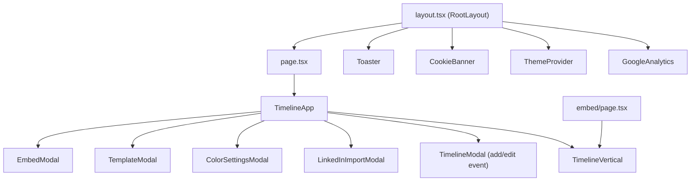

# Architecture Overview — Timeline Me

## 1. Tech Stack

| Area | Technology |
|------|-----------|
| Framework | Next.js 16 (App Router, Static Export) |
| UI Library | React 19 |
| Language | TypeScript |
| Styling | Tailwind CSS v4 + Shadcn/UI |
| PDF Parsing | `pdfjs-dist` (client-side) |
| Image Export | `html-to-image` |
| Analytics | Google Analytics 4 via `gtag.js` |
| Themes | `next-themes` (system-aware dark/light mode) |

## 2. Deployment

- **Build**: `npm run build` → Next.js SSG → static output in `./out/`
- **Hosting**: GitHub Pages (`https://agalliani.github.io/timeline-me`)
- **CI/CD**: GitHub Actions workflow at `.github/workflows/` — builds on push to `master` and deploys `./out` to `gh-pages` branch

## 3. Privacy Architecture

- **Fully client-side**: no backend, no server-side data collection.
- **Data storage**: all timeline data is stored in `localStorage` or encoded in URL query parameters.
- **Analytics**: GA4 is loaded only in production; initial consent is `analytics_storage: 'denied'` (Consent Mode v2). A GDPR consent banner (`CookieBanner`) is shown on first visit; the user must explicitly accept before GA4 fires events.

## 4. Component Map



## 5. Data Flow

```
User Input (PDF upload / manual form / template load)
    │
    ▼
TimelineItem[]          (raw data: string dates, label, category, description)
    │
    ├──► localStorage    (persisted across sessions)
    │
    ├──► URL ?data=…     (Base64-encoded { d: items, c: colorMap })
    │
    └──► Timesheet       (parses dates, computes grid layout)
              │
              ▼
         BubbleModel[]   (gridColumnStart, gridColumnSpan, dateLabel, …)
              │
              ▼
         TimelineVertical (renders CSS Grid rows)
```

## 6. Key Source Files

| File | Role |
|------|------|
| `src/types/timeline.ts` | Core TypeScript types (`TimelineItem`, `DateObj`, `BubbleModel`) |
| `src/lib/timesheet.ts` | Parses dates, computes grid layout (`Timesheet` class) |
| `src/lib/linkedin-pdf-adapter.ts` | Heuristic PDF parsing of LinkedIn exports |
| `src/lib/url-utils.ts` | Base64 encode/decode for URL sharing |
| `src/lib/analytics.ts` | GA4 event tracking helpers |
| `src/components/timeline-vertical.tsx` | CSS Grid rendering of bubble rows |
| `src/components/timeline-app.tsx` | Main app state, toolbar, modal orchestration |
| `src/components/google-analytics.tsx` | GA4 script loader + Consent Mode v2 |
| `src/components/cookie-banner.tsx` | GDPR consent banner |
| `src/app/layout.tsx` | Root layout (fonts, metadata, providers) |
| `src/app/page.tsx` | Main page (wraps TimelineApp in Suspense) |
| `src/app/embed/page.tsx` | Standalone embed viewer |
